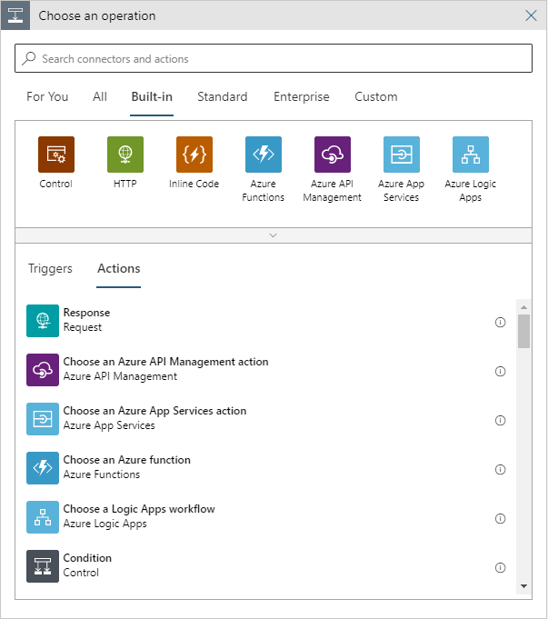
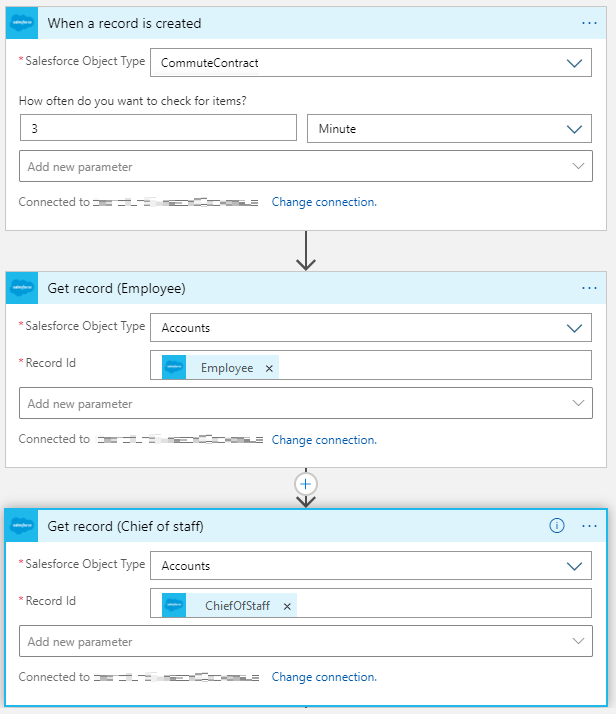
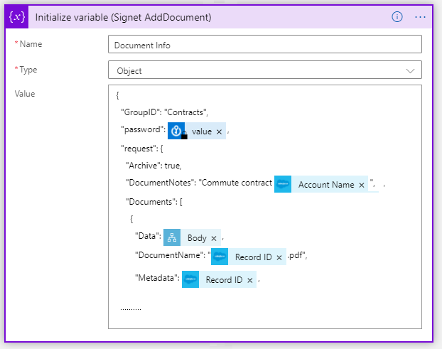
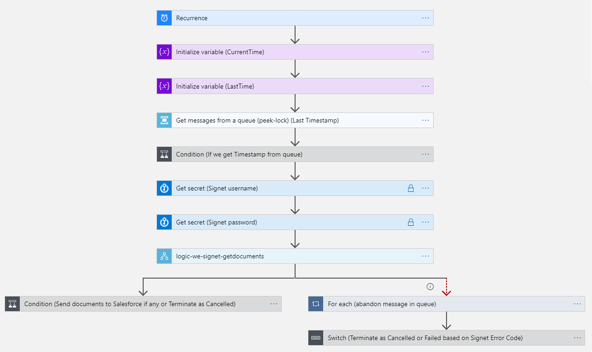
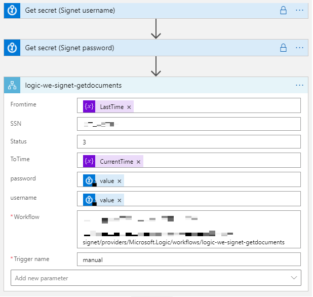
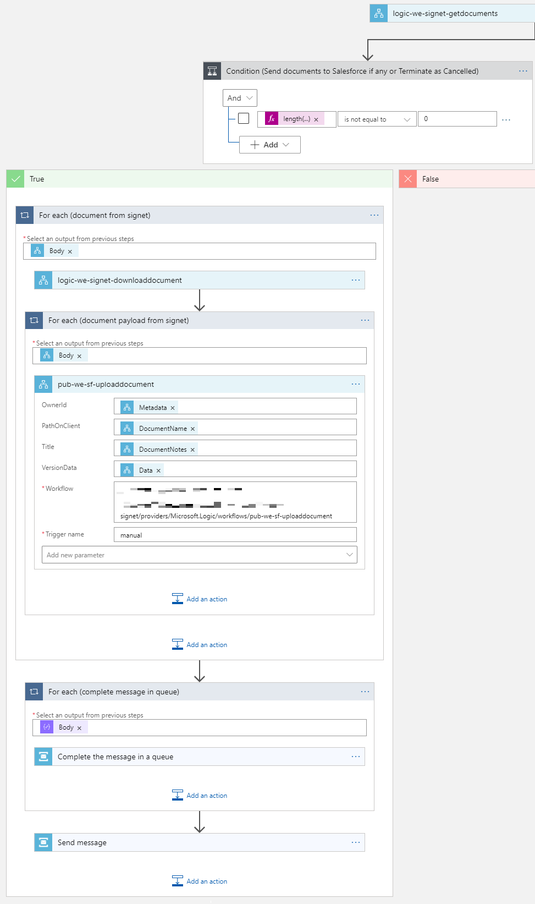
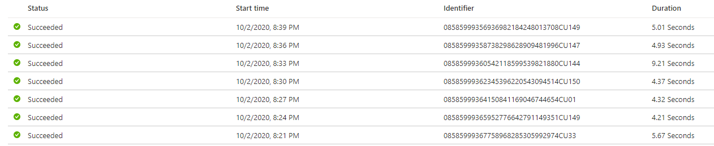
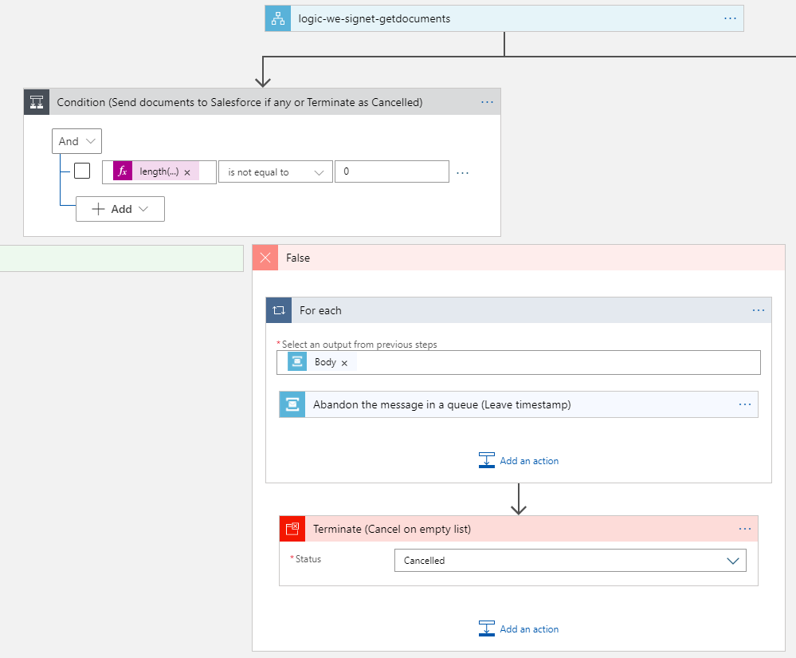
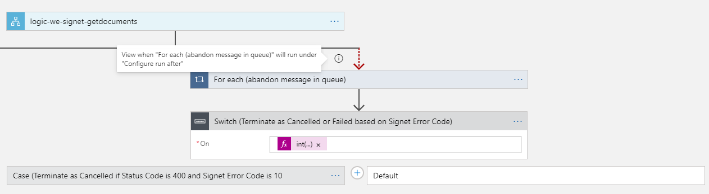
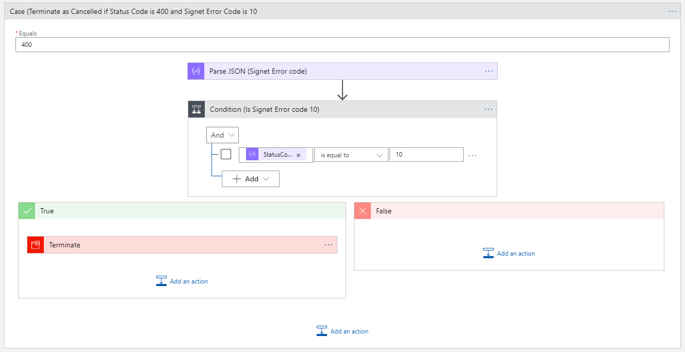

<link href="http://github.com/yrgoldteeth/darkdowncss/raw/master/darkdown.css" rel="stylesheet"></link> 

# Samþætting milli Salesforce og Signet með Azure Integration Services
> Þorleifur Bjarnason

<font size="1">Áætlaður lestrartími 30 til 40 mínútur.</font> 


Verkefnið gengur út á að samþætta `Salesforce` við `Signet`, með notkun á *`Microsoft Azure Integration Services`*. 

Markmiðið með verkefninu er að leysa sambærilegt verkefni og deildin `Samþætting og Ferlar` hefur verið að vinna með öðrum samþættingartólum um árabil. 
Sú vinna hefur verið fyrir mörg af stærstu fyrirtækum landsins, sem eiga það sammerkt að vera með mörg upplýsingakerfi og ríkar upplýsingaþarfir.

Sjá upplýsingar um samþættingu og ferlalausnir á https://www.advania.is/vorur-og-thjonusta/serlausnir/samthaetting-og-ferlalausnir/.

## Azure Integration Tools
*`Azure Integration Services`*, samanstendur af fjórum tólum, *`Logic App`*, *`Service Bus`*, *`API Management`* og *`Event Grid`*. 

Í þetta verkefni notuðum við *`Logic App`*, *`Service Bus`* og *``API Management``*.
Við förum lauslega yfir hlutverkin hér á eftir, en hægt er að kynna sér nánari upplýsingar hver þau eru á https://azure.microsoft.com/en-us/product-categories/integration/.
 
`*Event Grid*` hlutinn kom ekki við sögu í þessu verkefni.

## Skilgreining verkefnis, undirritun á samgöngusamning. 
Í verkefninu er sett upp eftirfarandi ferli milli `Salesforce` og `Signet`.
`Salesforce` notandi stofnar samgöngusamning sem spjald í `Salesforce` með því að fylla út form. Við þá aðgerð fer í gang samþættingarferli í Azure sem:
* Útbýr PDF skjal með samgöngusamningnum. 
* Sendir PDF skjal til undirritunar í `Signet`. 

Þegar samgöngusamningurinn er síðan undirritaður í `Signet`, fer í gang samþættingarferli í Azure sem:
* Setur undirritað PDF sem viðhengi á spjaldið með samgöngusamningnum.

### Yfirlitsmynd.
Myndin hér að neðan sýnir hringinn sem samgöngusamningurinn fer á milli `Salesforce` og `Signet`


### Yfirlitsmynd (BPMN2).
Ferlið sem Azure samþættingartólinu er ætlað að leysa í þessu verkefni má einnig teikna upp með BPMN2 sniði. BPMN2 er það snið sem viðskiptaferlar (business processes) eru hannaðir í. Mörg samþættingartól nýta BPMN2 einnig varðandi útfærslur á keyrslum viðskiptaferla. 
Myndin hér að neðan sýnir ferlið teiknað með BPMN2 sniði, og tengipunktar við endakerfin sýnd sem punktalínur.


## Um útfærslu verkefnisins

Verkefnið var unnið af Þorleifi Bjarnasyni, við úrlausn naut hann liðsinnis Hjalta Kristinssonar, Smára Nikulásar Guðmundssonar og Sögu Úlfarsdóttur. 

Það er rétt að þakka þeim aðilum sem hjálpuðu okkur að með kerfin sem við erum að tengjast.

Óli Þór Gunnarsson og Stefán Már Melstað gáfu okkur aðgang að prófunarumhverfi fyrir `Salesforce` þar sem lá fyrir innleiðing á samgöngusamning. 
Óli leiddi okkur líka í allan sannleikan um hvernig við gætum tengt PDF skjalið og samgöngusamninginn í `Salesforce` saman.

Sigurður Másson og Sveinbjörn Óskarson gáfu okkur aðgang að prófunarumhverfi `Signet`, og sáu til þess að við kæmum ekki að tómum kofa varðandi upplýsingar um virkni.

Í gegn um áratuga reynslu okkar af samþættingu vitum við stór hluti er unnin, ef aðgangur til nálgast gögnin úr kerfum fyrir þær samþættingar sem vinna með þeim er til staðar. 
Á árum áður voru flest kerfi lokuð, og það var sem hugmyndin um að eitthvað utanaðkomandi tól væri að krukka í því rifi hjartað úr rekstrar og ábyrgðaraðilum.
Sem betur fer er það viðhorf að breytast og flest kerfi farin að leggja sig fram um að bjóða samþættingarskil. 
Enda lifa þau kerfi sem ekki gera það í dag ekki harða samkeppni við ný kerfi sem bjóða upp á slík skil. Notagildi flestra hugbúnaðarkerfa er miklu meira en svo að það sé ásættanlegt að eina 
leiðin að upplýsingunum sé af notendum í gegn um lyklaborð og skjá.

# Almennt um Azure og Integration Services
Áður en við förum yfir útfærsluna á verkefninu er rétt að skoða hvernig unnið er með *`Azure Integration Services`*, og hvað tól eru notuð til þess að leysa þetta verkefni.

## Azure Resource Group
Allt sem við búum til í Azure þarf að vera sett í `Resource Group`. `Resource Group` er notuð til að flokka saman hluti tengda tiltekinni lausn sem verið er að smíða. `Resource Group` er hýst á tiltekinni staðsetningu í Azure, svo sem West Europe eða North Europe.
Hægt er að nýta sér hluti úr annarri `Resource Group` við útfærsluna, en að sjálfsögðu bindur það lausnina að því að sú `Resource Group` sé aðgengileg.

Nánari upplýsingar um `Resource Group` er að finna á
* https://docs.microsoft.com/en-us/azure/azure-resource-manager/management/overview
* https://docs.microsoft.com/en-us/azure/azure-resource-manager/management/manage-resource-groups-portal

Í þessu verkefni bjuggum við til `Resource Group` **dev-we-integration-sf-signet** þar sem við settum inn öll ``Logic App`` sem tengjast þessu verkefni. Við vorum hins vegar búin að útbúa bæði `API Management` og `Service Bus` í öðrum `Resource Group` sem við nýtum við útfærsluna.

Það er ekki sérstaklega þjált að vinna með `Resource Group` og flokkun lausna í Azure. Ekki er hægt að setja hluti niður á til að mynda möppur. Aðgerðir eins og til að mynda að endurnefna `Logic App` eru óþjálar og kosta að allt sem vísar í það `Logic App` brotnar. Þetta setur þær kvaðir á útfærslur að menn þurfa að hafa stillt þeim vel upp á teikniborðinu áður en vaðið er af stað. Það má síðan deila um það hvort það sé vont eða gott, það er alltaf gott að vera búin að skilgreina hver endaafurðin er áður en byrjað er að útfæra á fullu.
Þetta á reyndar almennt við um samþættingartól og líklega útfærslur á hugbúnaði almennt, að það er fljótlegra að gera þær en að flytja til og breyta eftirá.

## Azure Logic App
`Logic App` skilgreinir röð aðgerða í ferli (e: orchestrate), þar sem gögn úr skrefum á undan er aðgengileg í skrefum á eftir.
https://docs.microsoft.com/en-us/azure/logic-apps/logic-apps-overview

`Logic App` ræsist á skrefi sem fylgist með atburði (e:trigger). Atburður getur verið t.a.m. HTTP beiðni, atburður í skilgreindu endakerfi samkvæmt skilyrðum, tímaraðari (e: scheduler) og fl.
Í framhaldinu eru sett inn skref sem kalla á aðgerðir sem skilgreindar eru í `Logic App` umhverfinu. Krafan er hins vera sú að fyrsta skrefið verður að fylgjast með atburði, skrefin sem fylgja á eftir eru hins vegar aðgerðir.

Til eru staðlaðar atburðir/aðgerðir til að nota, svo sem að kalla á annað `Logic App`, ítra yfir gögn, velja leiðir (e: condition) og margt fleira. Einnig eru til tenglar í ýmis kerfi, svo sem `Office`, `SAP`, `Dynamics Nav` og mörg fleiri.

Hægt er að sníða sinn eigin tengil. Ef við erum til að mynda með endakerfi og `OpenAPI` skilgreiningu á aðgerðum í því kerfi, þá er hægt að útbúa eigin tengil til að hafa samskipti við það kerfi. Hér er að finna skjölun um hvernig unnt er að útbúa eigin tengil.
https://docs.microsoft.com/en-us/connectors/custom-connectors/create-logic-apps-connector. Það er meira að segja hægt að setja eigin tengil inn á markaðstorg Azure, til að gefa öllum Azure notendum kost á að nýta hann.

Hér að neðan er mynd af því hvernig unnt er að bæta skrefi inn í `Logic App`. Þar er fyrst að sjá að möguleg skref eru flokkuð saman. Fyrir hvern flokk er síðan hægt að skoða bæði
* hvaða atburðum er mögulegt að fylgjast með.
* hvaða aðgerðir er mögulegt að kalla á.



## Azure Service Bus
`Service Bus` er skeytamiðlari (e: message broker) sem unnt er að nota til lausbinda lausnir og þjónustur (e: decouple applications and services).
Sjá https://docs.microsoft.com/en-us/azure/service-bus-messaging/service-bus-messaging-overview.

Í `Service Bus` er unnt að hafa `Topic` og `Queue`. Í þessu verkefni notum við `Service Bus` með nafni **advania-dev**, Athugið að nafn á `Service Bus` þarf að vera einkvæmt gagnvart öllu Azure umhverfinu. Þar sem við erum búnir að búa til `Service Bus` advania-dev, þá getur engin annar stofnað `Service Bus` með því nafni. Þessi `Service Bus` er í `Resource Group` **dev-we-integration-test**, en það er bara vegna þess að við vorum búnir að setja hann upp áður en að við ákváðum að útfæra þetta verkefni í annari `Resource Group`. Það er svo sem ekkert óeðlilegt við þá högun, það er sennilegt að í útfærslum vilji menn nota sama `Service Bus` í fleiri en einu ferli. Sameignilegur `Service Bus` gæti jafnvel verið miðpunktur í að lausbinda mismunandi ferli saman.

## Azure API Management
`API Management` er notað til gefa út API skil gagnvart notendum, á öruggan og skalanlegan hátt.
Sjá https://docs.microsoft.com/en-us/azure/api-management/.

Í `API Management` er unnt að skilgreina API skil gagnvart ytri eða innri kerfum. Til að mynda er hægt að taka `Logic App` og sýna sem API skil gagnvart forriturum í öllum heiminum.
Í þessu verkefni notum við `API Management` með nafni **advania-dev**, Athugið að nafn á `API Management` þarf að vera einkvæmt gagnvart öllu Azure umhverfinu. Þar sem við erum búnir að búa til `API Management` advania-dev, þá getur engin annar stofnað `API Management` með því nafni. Þetta `API Management` er í `Resource Group` **dev-we-api-management-rg**, en það er bara vegna þess að við vildum setja öll API sem við erum útbúa inn á sama `API Management`. Hægt er að tengjast þessari uppsetningu af `API Management` með eftirfarandi slóðum:

`Developer Portal` slóð: https://advania-dev.developer.azure-api.net.

`API Gateway` slóð: https://advania-dev.azure-api.net.

Athugið að þegar þetta er skrifað erum við ekki búin að stilla `Developer Portal`, þannig að ekkert birtist þegar farið er inn á hann. Á einhverjum tímapunkti birtast þarna upplýsingar um API og leiðir til að tengjast þeim.
`API Gateway` slóðin virkar hins vegar eðlilega, og er notuð þegar við viljum nálgast þjónustur á þessari `API Management` uppsetningu.

Flest API sem eru skilgreind í `API Management` er læst með aðgangslykli. Í `API Management` tólinu er síðan unnt að skilgreina notendur og aðgangslykla fyrir þá. Þessir aðgangslyklar eru svo notaðir til að geta keyrt þjónusturnar í gegnum `API Gateway` á `API Management` uppsetningunni.

# Tengingar Logic App við endakerfi (Salesforce og Signet).
Til að leysa verkefnið voru útbúin tvö `Logic App` sem ræsast á atburðum. Annars vegar `Logic App` sem fylgist með því að samgöngusamningur sé stofnaður í `Salesforce`, og kemur honum til `Signet` til undirritunar. Hins vegar `Logic App` sem fylgist með að samningurinn sé undirritaður í `Signet`, og skilar undirritaða samningnum til `Salesforce`. 

Áður en við förum í að skoða útfærsluna á þessum tveimur ferlum, þá þurfum við að skoða hvaða leiðir eru færar til að tengjast þessum tveim mismunandi endakerfum úr `Logic App`.

## Tenging Logic App við Salesforce
Eins og með margar skýjalausnir er til tilbúin `Logic App` tengill til þess að tengjast `Salesforce`. Upplýsingar um hann er að finna á https://docs.microsoft.com/en-us/azure/connectors/connectors-create-api-salesforce. Það er í raun sáraeinfalt að tengjast honum, þú þarft aðgangsupplýsingar að `Salesforce` kerfinu sem þú ætlar að tengjast, og eftir að tengingin er búin til í Azure umhverfinu þá er hægt að nota hana í `Logic App` skrefum gagnvart því `Salesforce` kerfi. 

Við hjá `Samþættingu og ferlum` þekkjum vel til `Salesforce`. Bæði varðandi þróun og aðlögun í kerfinu sjálfu, sem og gagnvart samþættingu við önnur upplýsingarkerfi hjá viðskiptavinum. `Salesforce` kerfið er afar opið gagnvart samþættingum. 
Þessi `Logic App` tengill sýnir vel hvað skil gagnvart öllum gögnum í `Salesforce` kerfinu eru vel hugsuð, einföld og skilvirk.  
Aðgengi er að nálgast öllum gögnum í `Salesforce`, hvort sem um er að ræða staðlaða kerfishluta eða sérsniðna.

Vegna reynslu okkar af `Salesforce` vitum við að á bak við tengilinn eru í raun REST þjónustulag sem eru ætlaðar til að hafa samskipti við `Salesforce`.

### Aðgangsupplýsingar að Salesforce
Til að tengjast `Salesforce` þarf að vita þrennt:
* Hvort tenging sé gagnvart prófuner eða raunumhverfi `Salesforce`.
* Notendanafn.
* Aðgangsorð.

### Útbúa Salesforce tengingu
Til að tengjast `Salesforce` í `Logic App` þá er valið að setja inn `Salesforce` skref. Í skrefinu er boðið upp á að nota virka `Salesforce` tengingu, eða útbúa nýja eins og sjá má á meðfylgjandi skjáskoti. 


### Salesforce Logic App atburðir (triggers)
Öll `Logic App` verða að ræsast með atburði (e: triggers). `Salesforce` tengillinn býður upp á fylgjast með tveim gerðum atburða,


### Salesforce Logic App aðgerðir (actions)
`Logic App` getur síðan kallað á aðgerðir í kerfum. `Salesforce` tengillin býður upp á allnokkurn fjölda aðgerða.


## Tenging Logic App við Signet
Ólíkt Salesforce, liggur ekki fyrir tengill gangvart `Signet` í Azure umhverfinu. Hægt er að kalla á `Signet` með SOAP eða REST þjónustum. Í verkefninu völdum við að nýta okkur REST þjónusturnar sem `Signet` býður upp á. Skjölun á `Signet` þjónustum er að finna hér https://info.signet.is/ og nánari lýsingu á þjónustunum sem við erum að nota er að finna hér https://prufa.signet.is/SignetService2/v3/Help.
`OpenAPI` skilgreining á þjónustunum liggur fyrir hérna https://prufa.signet.is/SignetService2/v3/swagger/index.html?url=/SignetService2/v3/swagger/v1/swagger.json

### Aðgangsupplýsingar að Signet
Til að tengjast `Signet` þarf að vita þrennt:
* Hvort tenging sé gagnvart prófunar eða raun umhverfi `Signet` (prufa.signet.is eða www.signet.is).
* Notendanafn.
* Aðgangsorð.

Ennfremur verður að hafa fengið:
* Biðlaraskilríki. (e: Client Certificate)

Biðlaraskilríkið þarf að vera sent með þegar kallað er á aðgerðir til að auðkenna biðlarann á þjónusturnar.

### Útbúa Signet tengingu
Þar sem að ekki er til tengill í Azure gagnvart Signet, þá eru litum við á nokkra valkosti til að gera kerfið aðgengilegt fyrir `Logic App`. Við skulum renna yfir þessa kosti.

#### Leið 1: Útbúa eigin tengil beint á þjónusturnar (Ekki notuð í verkefninu)
Þar sem til er `OpenAPI` skilgreining á þjónustunum, liggur beinast við að útbúa eigin tengil (e: custom connector) við `Signet` samkvæmt leiðbeiningum sem vísað er í hér að ofan.
Athugið, að þegar við gerðum verkefnið var rákumst við ekki á þessa `OpenAPI` skilgreiningu, og því var þessi leið ekki skoðuð þá. 
Þar sem `OpenAPI` skilgreining er til staðar litum við á hvort unnt væri að útbúa tengil gagnvart skilgreiningunni beint á `Signet` þjónusturnar.
Það virðist ekki ganga, þar sem að við sjáum ekki í fljótu bragði leið til að senda biðlaraskilríkið með sem auðkenningu inn í eigin tengil.
Til staðfestingar má líta á https://docs.microsoft.com/en-us/azure/logic-apps/logic-apps-securing-a-logic-app í kafla "Client Certificate authentication", þar sem fram kemur: "Note: Custom connectors don't support certificate-based authentication for both inbound and outbound calls."


Eins og sjá má á myndinni stöðvaði það hvernig koma skal biðlaraskírteini inn í `Signet` tengilin notkun á þessari leið.

##### Athugasemdir
Innflutningur á `OpenAPI` skilgreiningunni beint frá `Signet` slóð heppnaðist reyndar ekki nema að skrifa hana niður í skrá og vísa síðan í skránna. 
Þegar sett er inn https://prufa.signet.is/SignetService2/v3/swagger/v1/swagger.json sem tilvísun á `OpenAPI` lýsingu, kemur villan 
"We weren’t able to download the OpenAPI file from the provided URL. Please upload the file manually using the "Import from OpenAPI file" option."
Það gekk hins vegar að fara þá leið að nota skrána. Athugið að það er samt talsvert af athugsemdum sem koma fram í Azure tenglinum við OpenAPI skilin.

#### Leið 2: Kalla beint á þjónusturnar með HTTP kalli. (Ekki notuð í verkefninu)
Þegar við litum á þessa leið sáum við að við þyrftum aðeins að kalla á örfáar þjónustur í `Signet`, eða 
* AddDocument
* GetDocuments
* DownloadDocument

Því var skoðað sem styttri leið að kalla beint á þessar þjónustur úr `Logic App` með HTTP kalli.
HTTP skrefið gefur okkur kost á senda inn biðlaraskilríki (e:client certificete), þannig að útfærsla á þessu ætti að vera eins og göngutúr á Klambratúni.
Við prófanir kom hins vegar í ljós að þetta var ekki að ganga sem skildi. Rannsóknir leiddu í ljós að Azure umhverfið treystir ekki biðlaraskilríkinu sem sent er með skeytunum. Það er í sjálfu sér eðlilegt, þar sem rótarskilríkið er "Advania Prófun", sem er ekki hluti af rótarskilríkjum sem Azure treystir. Það tók nú smá tíma að átta sig á þessu þannig að gönguferðin varð aðeins meira krefjandi.


Eins og sjá má á myndinni stöðvaði það að biðlaraskírteinið er ekki vottað af treystum aðila notkun á þessari leið.

#### Leið 3: Kalla á þjónusturnar gegn um API Management. (Notað í verkefninu)
Við skoðun virðist sem að eina leiðin til að fá Azure til að treysta þessu biðlaraskilríki sé að setja `Signet` þjónusturnar upp í `API Management`, og láta `Logic App` kalla á þær í gegn um `API Gateway`. `API Management` er þá með skilríkið skráð, og notar það til að staðfesta biðlarann gagnvart `Signet`.
Út frá markmiðum verkefnisins var þetta hið besta mál, þar sem þarna gefst upplagt tækifæri til að nýta sér `API Management` hluta af *`Azure Integration Services`*.

Leiðin frá `Logic App` að `Signet` þjónustunum er því með HTTP kalli á `API Gateway` https://advania-dev.azure-api.net/signet sem vísar kallinu á https://prufa.signet.is/SignetService2/v3/api/Signet/ og bætir skilríkinu við.
Athugið að `Logic App` þarf að fá API lykil frá `API Management` kerfinu til að fá aðgang að þjónustunum.


[Aðferðin við að skrá þjónusturnar í Azure `API Management`, og setja inn biðlaraskilríkin er efni í annann pistil.](api-management-signet.md).

#### Leið 4: Útbúa eigin tengil á API Management þjónusturnar (Ætti að vera notað í verkefninu)
Eins og fram kemur í leið 1 hér að ofan, er eðlilegt að nota `OpenAPI` skilgreininguna til að útbúa eigin tengil (e: custom connector) í Azure. Eins og fram kom þar var vandamál að okkur tókst ekki með auðveldum hætti að koma biðlaraskilríkinu til skila. Ekki bætti úr skák að skilríkinu er ekki treyst eins og fram kom í leið 2.
Fyrst það er möguleiki á að skrá og treysta biðlaraskilríkinu í `API Management`, þá er eðlilegt að setja alla `OpenAPI` skilgreininguna í `API Management`.
Í framhaldinu myndum við útbúa tengilin á skilin í `API Management` hlutanum, og fá þannig starfhæfan tengil gagnvart `Signet`.
Sá tengill þarf að fá API lykil til þess að auðkenna sig á móti þjónustunum.


API lykill er þá settur inn sem hluti af tengiupplýsingum við `Signet` tengilinn.

# Útfærsla með Logic App
Útbúin voru 2 `Logic App` til að leysa verkefnið. 

## Logic App logic-we-trigger-sf-to-signet-signing
Þetta `Logic App` fer í gang þegar það verður til nýr samgöngusamningur í `Salesforce`. 

Til að geta útbúið PDF skjal með öllum upplýsingum varðanda samgöngusamninginn, þá þarf að fletta upp upplýsingum um starfsmanninn og mannauðsstjórann sem eru tengdir samningnum. `Salesforce` tengillinn er notaður í þessar uppflettingar.

PDF skjal er síðan útbúið með því að kalla á `Logic App` (**logic-pub-create-pdf**). Inntak eru upplýsingar um samgöngusamninginn sem komu frá`Salesforce`.

Að síðustu er PDF skjalið sent til `Signet` til undirritunar. Þar sem við útbjuggum ekki tengil eins og lýst er í leið 4 um `Signet` tengingu hér að ofan, þá hjúpuðum við kallið á `AddDocument` með `Logic App` (**logic-we-signet-adddocument**). Sjá nánar í upplýsingum um leið 3 í kaflanum um `Signet` tengingu hér að ofan.


Sem samantekt, þá er þetta ferli í rauninni 3 meginskref, sem við skulum skoða hvert fyrir sig.

### Gögn frá Salesforce
Fyrstu 3 skrefin ganga út að nálgast upplýsingar varðandi samgöngusamninginn frá `Salesforce`. 

Ræsirinn (e: trigger) á `Logic App` er að útbúinn er ný færsla í `Salesforce` af gerðinni samgöngusamningur. Eins og sést á myndinni af ferlinu er þetta kannað á 3 mínútna fresti, sem þýðir að það geta liðið allt að 3 mínútur frá því að samningurinn er stofnaður, þar til ferlið fer í gang.

Í framhaldinu er flett upp í Account töflu `Salesforce` upplýsingum um bæði starfsmann og mannauðsstjóra í tveimur skrefum. Inntakið í uppflettinguna, eru tekið úr gögnunum sem komu með samgöngusamningum sem ræsti ferlið. í samgöngusamningnum er svæði sem heitir Starfsmaður og svæði sem heitir Mannauðsstjóri sem innihalda tilvísun á Account færslur viðkomandi aðila.



### Útbúa PDF
Samgöngusamningurinn í `Salesforce` inniheldur ekki PDF skjal til undirritunar. Í þessu skrefi nýtum við okkur þjónustu sem við höfum skrifað í öðru platformi til að framleiða PDF. Sem hluta af þessari innleiðingu skoðuðum við að flytja þá virkni í Azure sem Azure Function. Í ljós kom að það ætti að vera gerlegt, en kostaði örlítið meiri vinnu en við vorum tilbúnir að leggja í að þessu sinni. Við tókum því þá ákvörðun að kalla á þjónustuna þar sem hún er hýst núna og bíða aðeins með að Azure Function aðferðina. 
Í raun er þetta bara REST þjónusta sem tekur við upplýsingum úr samgöngusamningnum og framleiðir frekar hrátt PDF skjal til að undirrita.


Í skrefinu útbúum við JSON hlut sem heitir `PDFFields`, í svæðin vísum víð síðan í breytur úr `Salesforce` skrefunum sem búið var að útfæra. Sem dæmi þá er breytan empname í `PDFFields` sett sem gildið á Account Name úr `Salesforce` skrefinu GetRecord (Starfsmaður), sjá mynd.


Þessi `PDFFields` eru síðan inntak í **logic-pub-create-pdf** sem hjúpar REST þjónustuna sem til að búa til PDF skjal. 

Þessi dæmi sýna hvernig breytur eru aðgengilegar í skrefum sem verið er að keyra í `Logic App`.

ATHUGIÐ að þegar tekið er skjáskot af skrefi sem kallar á annað `Logic App` birtir workflow breytan upplýsingar sem þú vilt ekki að fari á flakk. Það er mikilvægt að gera slíkar upplýsingar ólæsilegar. Það hefur verið gert í skjáskotinu hér að ofan.

### Senda til Signet
Nú eigum við PDF skjal tilbúið, og það eina sem er eftir er að senda það til undirritunar. `Signet` þjónusturnar eru þannig úr garði að með kalli til þeirra þarf að senda notendanafn og aðgangsorð sem hluta af gögnunum. Það þýðir að við þurfum að hafa þær upplýsingar undir höndum þegar að við köllum á `Signet`. Notendanafnið er eflaust ekkert leyndarmál, en aðgangsorðið er klárlega eitthvað sem við viljum ekki að fari á flakk og geymum með öruggum hætti. Við myndum ekki halda ISO 27001 vottun lengi ef við færum að harðkóða þessi gildi með læsilegum texta. 

Azure býður okkur upp á `Key Vault` sem er sniðið að því að geyma svona upplýsingar. Við útbjuggum því `Key Vault` og geymum reyndar bæði notendanafnið og lykilorðið að `Signet` í því. Upplýsingar um `Azure Key Vault` er að finna hérna https://docs.microsoft.com/en-us/azure/key-vault/.

Sendingin til `Signet` felur því í sér að sækja þessar aðgangsupplýsingar í `Key Vault`. Útbúa JSON hlut með fyrirskipun um að stofna skjal í `Signet` og að síðustu stofna skjalið.
Takið eftir lásnum á skrefunum sem að sækja aðgangsupplýsingar. Við setjum hann á skrefin til að segja að úttakið úr þessari þjónustu innihalda viðkvæmar upplýsingar sem má alls ekki birta.
Sjá nánari upplýsingar á https://docs.microsoft.com/en-us/azure/logic-apps/logic-apps-securing-a-logic-app og sér í lagi kaflann um "Secure data in run history by using obfuscation". 
Það er hægt að setja þessar stillingar á hvaða skref sem er. Það þýðir að ef þjónustur sem verið er að kalla í `Logic App` skila viðkvæmum persónuupplýsinum, getum við tryggt að þær verði ekki skráðar niður með læsilegum hætti.


Á sama hátt og í skrefunum sem gerðu PDF skjalið, þá setjum við JSON hlut `Document Info` samkvæmt skjölun frá `Signet` með öllum upplýsingum sem þarf til þess að setja inn skjal til undirritunar.



Eins og sjá má á skjáskotinu af `AddDocument` skilunum, erum við að vísa í upplýsingar úr flestum fyrri skrefum sem búið er að keyra.
Við sjáum að aðgangsorðið er með svartann lás á breytuna, sem er vegna þess að það kemur úr skrefi sem við erum búin að merkja að sé með viðkvæmar upplýsingar.

Takið sérstaklega eftir að við setjum tilvísun á `Salesforce` samgöngusamninginn í svæði sem heitir `Metadata` í `Signet`. Þetta er notað til tengja skjalið í `Signet` við samgöngusamninginn í `Salesforce`. Síðar í verkefnininu, þegar að við fáum PDF skjalið undirritað frá Signet, þá vitum við hvaða samgöngusamning við viljum hengja það á út frá þessu `Metadata` svæði. Þarna má segja að við séum nokkuð heppin. Í mörgum af þeim samþættingarferlum sem við höfum unnið gegn um árin, þá höfum við þurft að geyma tilvísanir milli kerfa til hliðar, þar sem ekki er kostur á að láta tilvísanir fylgja með gögnunum.

## Logic App logic-we-scheduler-signet-signed-to-sf
Þegar kemur að því að sækja undirritaða samninga frá `Signet` þá eru ýmsar leiðir í boði. Besta leiðin er segja `Signet` að kalla á REST þjónustu við undirritun á skjali. 
Við myndum þá útfæra REST þjónustu, og senda `Signet` upplýsingar um þjónustuna sem `Metadata` með innsendum skjölum. Það er stuðningur til að gera það í `Signet` og hægt að kynna sér upplýsingar um það í skjölun.
Að sjálfsögðu myndum við setja þá REST þjónustu upp á `API Management` og láta `Signet` senda API lykill til að fá aðgang að þjónustunni.
Athugið að til þess að þessa leið gangi þarf að einnig að setja inn stillingar í `Signet` varðandi þjónustu fyrir bakslag (e:fallback). 

Þar sem markmið í verkefninu var að nota mismunandi hluta af `Azure Integration Services`, ákváðum við að fara aðra leið með því að nota `Service Bus` og tímaraðara.

Við látum þetta `Logic App` vinna með biðröð (`Queue`) í `Service Bus`. Í þessari biðröð ætlum við geyma tímastimpil á síðasta undirritaða skjali.

Þessi vinnsla er í anda við mörg samþættingarferli sem við höfum gert á undanförnum árum. 
Þá er kannað hvort það séu komin ný gögn í endakerfi út frá ákveðnum tímastimpli, og eftir keyrsluna er tímastimpillinn uppfærður. 
Það er ekki oft sem boðið er upp á gerast áskrifandi af uppfærslum í endakerfum, svo sem með `Webhook` eða þeirri leið sem `Signet` er að bjóða. 
Dæmi um kerfi sem við höfum samþætt með þessum hætti eru til að mynda `ServiceNow`, `Ax`, `Navision`, `Eloomi`, `H3`, `Retail in Motion` og fleiri. 
Krafan við þær samþættingar er að flytja þarf breytingar úr viðkomandi kerfi frá ákveðnum tímapunkti í önnur kerfi.
Næsta keyrsla vinnur þá með nýjan tímastimpil og sækir ekki sömu gögnin aftur. 

Fyrir keyrslur á alltaf að liggja fyrir tímastimpill á biðröðinni til að vinna frá. Venjulega erum við nú ekki að nota biðröð til að geyma svona upplýsingar, 
en það var gert þarna til að sjá hvernig `Service Bus` skilin starfa.

Þetta `Logic App` fer í gang með tímaraðara á þriggja mínútna fresti. 

Við keyrslu athugar það hvort til séu ný undirrituð skjöl í `Signet` út frá tímastimpli sem er sóttur af biðröð.
Ef ný undirrituð skjöl finnast, er þau hengd á viðeigandi samgöngusamninga í `Salesforce`. Að lokum er nýr tímastimpill settur á biðröð. 
Það á að tryggja að í næstu ítrun verði eingöngu sótt ný skjöl.



Þetta `Logic App` inniheldur nokkrar rökaðgerðir, sem við þurftum ekki að nota í **logic-we-trigger-sf-to-signet-signing**.

Sem samantekt, þá er þetta ferli í rauninni 4 meginaðgerðir, sem við skulum skoða hvert fyrir sig.

### Sækja og setja tímastimpla af biðröð.
Ferlið sækir tímastimpil til að vinna frá af biðröð í `Service Bus`. Það er sótt með `Service Bus` aðgerð sem sækjir skeyti af biðröð. 
Skeytið sem kemur inniheldur tímastimpilinn sem síðasta keyrsla skildi eftir á biðröðinni.
Biðröðin vinnur þannig að þegar skeyti er sótt af henni, þá er því læst. Önnur ferli geta ekki fengið sama skeytið af biðröðinni á meðan lásinn gildir. 
Athugið að lásinn rennur út eftir 30 sekúndur og því þarf að vera búið að ákveða hvað á að gera við skeytið fyrir þann tíma. Ef það tekur lengri tíma að ákveða sig er unnt að endurnýja lásinn innan tímamarka.
Í ferlinu þarf síðan að velja hvort það eigi að afgreiða skeytið eða hunsa það. Ef skeytið er afgreitt hverfur það af biðröðinni, en ef það er hundsað liggur það óhreyft á biðröðinni.
Fyrir þessa útfærslu verðum við svo að passa að ef við afgreiðum skeytið, skiljum við nýjan tímistimpill eftir á biðröðinni. 
Aðgerðirnar í `Service Bus` sem við notum eru.

* Sækja skeyti (Get messages from a queue (peek-lock))
* Afgreiða skeyti (Complete the message in a queue)
* Hunsa skeyti (Abandon the message in a queue)
* Senda skeyti (Send message)

Í fyrsta hlutanum af ferlinu er breyta með tímastimplinum núllstillt, og skeyti með tímastimpli sótt af biðröð. Skrefin til að afgreiða, hunsa og senda skeyti verða síðan tíunduð í tengdum aðgerðum.
Í ferlinu ætlum við að afgreiða skeytið af biðröðinni þegar það er búið að senda undirritaðan samgöngusamning til `Salesforce`. 
Ef enginn undirritaður samningur berst, þá hunsum við skeytið og skiljum það eftir á biðröðinni. Með öðrum orðum, við uppfærum ekki tímastimpilinn nema við fáum undirritað skjal frá `Signet`.


Eins og sést á myndinni af ferlinu þá er tekið á því ef ekkert skeyti er á biðröðinni. Þá notum við bara núverandi tíma sem tímastimpil.

Til að kanna hvort að við höfum fengið skeyti af biðröðinni skoðum við hvort að lengd listans sé önnur en 0.
Við veljum að hámarksfjöldi skeyta til að sækja sé 1, þannig að við fáum bara 1 tímastimpil af biðröðinni.
Athugið að þó við veljum að sækja bara 1 skeyti, þá er niðurstaðan samt sem áður listi af skeytum. Listinn inniheldur þá aðeins 1 skeyti.

### Sækja lista af undirrituðum skjölum frá Signet.
Við sækjum lista af undirrituðum skjölum, með því að nálgast öll skjöl með stöðuna 3 (sem þýðir undirrituð) frá `Signet`. Við leitum í skjölum á tímabilinu frá `lastTime` (tímastimpillinn sem kom úr biðröðinni) til `CurrentTime`.
Eins og í **logic-we-trigger-sf-to-signet-signing** erum við að sækja aðgangsupplýsingar að `Signet` úr `Key Vault`. Við hjúpum kallið í `GetDocuments` í annað `Logic App` (**logic-we-signet-getdocuments**).



Hér er reyndar rökvilla í útfærslunni hjá okkur sem yrði að laga áður en við settum þetta í raunverulega notkun. 
Eins og fram kemur að ofan erum við aðeins að skoða þessa útfærsluleið og munum aðlaga ferlið við raunverulega innleiðingu.

### Senda undirrituð skjöl til Salesforce.
Ef við fáum lista af skjölum frá `Signet` sem er ekki tómur, þá fara í gang nokkrar slaufur til að senda PDF skjölin til `Salesforce`.
Það er vegna þess að `GetDocuments` skilar okkur lista af skjölun frá `Signet` án innihalds (í raun handfang á skjal). 
Við sækjum síðan innihaldið af hverju skjali fyrir sig frá `Signet` með því að senda handfang á skjalið í `DownloadDocument`.
`DownloadDocument` skilar okkur þá lista með PDF skjölum fyrir það handfang.
Við þurfum því að ítra yfir tvo lista til að koma PDF skjölunum til `Salesforce`.

Sauðakóðinn af sendingu skjala til `Salesforce` sem verið er að útfæra í þessu `Logic App` lítur því svona út:

```
for each document id from GetDocuments (Signet)
	call DownloadDocument (Signet) with document id
	for each payload from DownloadDocument (Signet)
		call UploadDocument (Salesforce)
```
Líkt og í fyrri samskiptum við `Signet` setjum við aðgerðina `DownloadDocument` í `Logic App` (**logic-we-signet-downloaddocument**).

Við hjúpum aðgerðina til að hlaða skjalinu upp í `Salesforce` í `Logic App` (**pub-we-sf-uploaddocument**). 
Vinnslan við að hlaði skjalinu upp í `Salesforce` er fleiri en eitt skref. Fyrst þarf að hlaða skjalinu inn í `Salesforce` og síðan þarf að tengja það réttum samgöngusamningi. 
Það er ástæðan fyrir að við settum það upp í sérstakt `Logic App`. Eins og sést í skjáskotinu er skilgreint hvaða inntaksgildi geta komið í **pub-we-sf-uploaddocument**.
Takið sérstaklega eftir `Metadata` svæðinu. Það er svæðið sem við notuðum til að geyma tenginguna við `Salesforce` samgöngusamninginn þegar við sendum PDF skjalið til `Signet`.
Þegar við sendum skjalið inn í `Salesforce` er það sett inn sem eiganda á skjalinu. 

Þegar búið er að setja öll PDF skjölin í `Salesforce`, þá viljum við skilja nýan tímastimpill eftir á biðröðinni.
Við keyrum því lykkju til að afgreiða öll skeytin sem við sóttum af biðröðinni. Við verðum að ítra yfir lista, þó að þeir innihaldi aðeins eitt stak.
Við setjum síðan `CurrentTime` sem nýjan tímastimpil á biðröðina fyrir næstu keyrslu.



### Setja stöðu keyrslu sem 'Cancelled' ef engin ný skjöl berast frá Signet.
Þar sem ferlið keyrir alltaf á þriggja mínútna fresti eru talsverðar líkur á að ekkert skjal hafi verið undirritað frá síðustu keyrslu.
Þrátt fyrir það keyrir ferlið og skráir í keyrslusögu að það hafi keyrt með góðum árangri. 

Öll `Logic App` skrá niður keyrslusögu, og þar er má skoða ítarlegar upplýsingar um hverja keyrslu fyrir sig. Bæða hvaða skref eru keyrð, og hvaða gögn streyma í gegn. 
Þar sem við erum ISO vottuð og með mikla öryggisvitund, þá höfum við passað að merkja öll skref með viðkvæmum upplýsingum, þannig að þær skráist ekki niður með keyrslunni.
Ef við lítum á keyrslusöguna, þá sjáum við allar keyrslur ljúka eðlilega á þriggja mínútna fresti, líka þær sem fengu engin skjöl frá `Signet` til að senda `Salesforce`.



Við viljum aðgreina keyrslur sem fá skjöl til að afhenda `Salesforce` frá þeim sem gera það ekki.
Í **logic-we-scheduler-signet-signed-to-sf** er þetta ekki vandamál, þar sem það ræsist ekki nema að nýr samgöngusamningur liggji fyrir í `Salesforce`.
Leiðin sem við notum til að ná þessu fram er `Terminate` skrefið í `Logic App`. Þá er hægt að láta ferlið hætta keyrslu með mismunandi stöðu (e: status).
Stöðurnar sem eru í boði eru 'Succeeded','Failed' og 'Cancelled'. Við veljum að láta ferlið hætta með stöðuna 'Cancelled' þegar að engin undirrituð skjöl berast. 
Það er út af fyrir sig eðlileg ráðstöfun, þar sem ferlið gerði í raun ekki neitt.

Eftir þá ráðstöfun breytast upplýsingarnar í keyrslusögunni, þannig að eingöngu ferli sem finna skjöl hætta í stöðunni 'Succeeded'. 
Hin ferlin hætta í stöðunni 'Cancelled'. Auðvitað geta alltaf komið upp villur, það er ekkert sem segir að `Signet` og `Salesforce` séu eins og skátarnir, og þær keyrslur sem hitta á erfiða tíma fá stöðuna 'Failed'. 
Keyrslusagan hér að néðan sýnir dæmi þar sem upp kom villa í keyrslunni. Þá er auðvelt að skoða einstaka keyrslu til að kanna hvað kom upp á.


Ef við lítum á útfærsluna, þá eru tvö tilfelli af svörum frá `GetDocuments` kallinu í`Signet` sem segja okkur að engin ný undirrituð skjöl hafi fundist fyrir tímabilið:
* `200 OK` og tómur listi af gögnum. 
* `400 Bad Request` og villusvarið inniheldur "StatusCode": "10" með villutextann "No documents found".

Munurinn á þessum tveim svörum er að þegar `200 OK` kemur þá eru til skjöl á tímabilinu, bara ekkert sem er undirritað. 
Ef `400 Bad Request` kemur, þá eru engin skjöl til fyrir tímabilið.

Þegar þjónusta svarar ekki með kóða á milli 200 og 299, þá er í raun um frávik að ræða (e: exception). 
Til að meðhöndla þetta frávik þarf maður að nýta sér að hægt er að setja inn skref sem keyra eingöngu við frávik (e: exception handling).

Í `Logic App` þá er þessi vinnsla til að merkja keyrsluna 'Cancelled' því á tveimur stöðum til að dekka báða möguleikana sem koma upp.

#### 200 OK og tómur listi af skjölum.

Þarna kemur `200 OK`, en það koma engin undirrituð skjöl í listann frá `Signet`. Þá hunsum við skeytið með tímastimplinum af biðröðinni, og hættum keyrslu með stöðu 'Cancelled'.
Sami tímastimpill verður notaður af biðröðinni við næstu keyrslu. 



#### 400 Bad request og "Status Code" er 10.

Í þessu tilfelli skilar kallið á `GetDocuments` fráviki. Frávik eru höndluð með því að búa til leið í `Logic App` sem er farinn við frávik.
Takið eftir að leiðin sem er valin er með rauðri punktalínu og upplýsingamerki til hliðar. Það segir okkur að það séu stillingar eru á skrefinu sem stýra því hvenær þessi leið sé farin. 

Við byrjum á að hunsa skeytið með tímastimplun af biðröðinni, til að tryggja að tímaspillinn verði eftir þar fyrir næstu keyrslu.



Við viljum ekki ljúka keyrslunni með stöðu 'Cancelled' nema að "Status Code" sem kemur frá `Signet` sé 10. þannig að við erum með `Case` setningu fyrir 400 tilfellið, sem athugar svort að "Status Code" sé 10 og lýkur keyrslu með stöðu 'Cancelled' ef svo er.




Eins og sést í þessu dæmi er ekki sérstaklega þjált að vinna með hreiðraðar rökaðgerðir í `Logic App`. Ferlin blása aðeins út og verða illlæsileg. 
Eflaust hefði verið heppilegra að setja þennan hluta af ferlinu í **logic-we-signet-getdocuments**, og breyta þá skilagildi í `200 OK` og tóman lista.

# Niðurlag
Þessi samþættingartól líta vel út, og eru í dag mjög sniðug til þess að samþætta kerfi af því tagi sem við erum að horfa á hér, Skýjalausnir með skilgreind REST skil.
Einnig virðist vera mjög góður stuðningur að tengja ferli við skýjalausnir Microsoft, svo sem Office, Outlook og Dynamics Nav. 
Við skoðuðum líka að tengjast `SQL Server` gagnagrunni sem var hýstur hjá okkur með Azure On-Premise Data Gateway. `Logic App` gat þá flett upp í þessum grunni vandræðalaust.

[Við höfum útfært `Power App`, gagnvart REST skilum sem við höfum sjálfir gert, með góðum árangri.](api-management-signet.md). 
`Logic App` og `API Management` skil fyrir `Power App` gæti verið valkostur gagnvart OutSystems fyrir smærri verkefni.

Okkur grunar samt að við stærri samþættingar, þurfi að grípa til annarskonar verkfæra samhliða, til að ná sambærilegum afköstum fyrir forritar og með öðrum tólum sem við höfum notað.

> Birt 23.11.2020, Þorleifur Bjarnason.

