<link href="http://github.com/yrgoldteeth/darkdowncss/raw/master/darkdown.css" rel="stylesheet"></link> 

# Integration between Salesforce and Signet with Azure Integration Services
> Þorleifur Bjarnason

<font size="1">Estimated reading tíme 30 to 40 minutes.</font> 


In this project we integrate `Salesforce` and `Signet` using *`Microsoft Azure Integration Services`*. 

The goal of the project is to use Azure Integration Platform to integrate systems. Similar to processes that we have implemented with dedicated on premise integration tools from other vendors.

## Azure Integration Tools
*`Azure Integration Services`*, contains 4 tools, *`Logic App`*, *`Service Bus`*, *`API Management`*and*`Event Grid`*. 

In this project we use *`Logic App`*, *`Service Bus`* and *``API Management``*.
We look briefly into purpose of each tool later in this document, but further information can be found on https://azure.microsoft.com/en-us/product-categories/integration/.
 
`*Event Grid*` is not used in this project.

## Definition on project, electronic signature on commute contract. 
In the project we define the following process between `Salesforce`and`Signet`.
`Salesforce` user creates commute contract as card in `Salesforce` by filling out form. By doing that we start integration process in Azure that:
* Creates PDF document with commute contract. 
* Sends PDF document to signature in `Signet`. 

When commute contract is signed in `Signet`, we start integration process in Azure that:
* Puts signed PDF as attachment on the card with commute contract.

### Overview.
The following picture shows the route that the commute contract travels between `Salesforce`and`Signet`

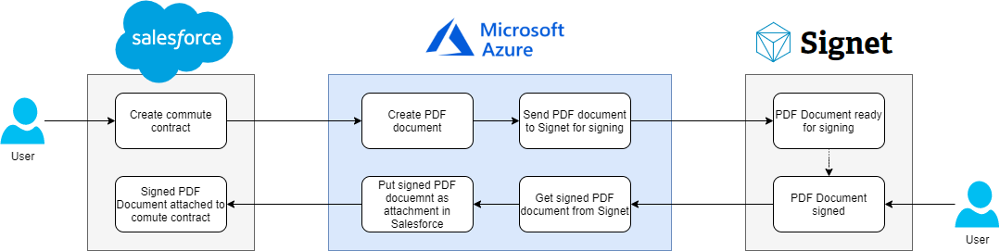

### Overview (BPMN2)
The process can be drawn with BPMN2. BPMN2 is the graphical representation for business processes. Many integration tools utilize BPMN2 for implementation and runtime. 
The following picture shows BPMN2 representation for the process. Connections to the systems are showed as dotted lines.

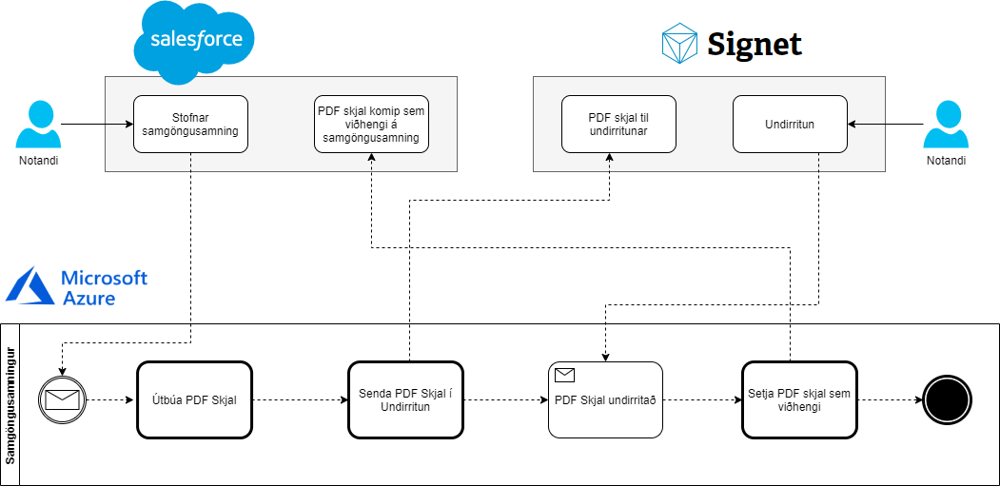

## About implementation

The project was implemented by the following team Thorleifur Bjarnason, Hjalti Kristinsson, Smára Nikulásar Guðmundsson and Saga Úlfarsdóttir. 

We got help from following people in to create connections and define data.

Óli Þór Gunnarsson and Stefán Már Melstað gave us access to `Salesforce` sandbox, with implemented commute contract card. 
Óli also helped us to attach PDF document to commute contract card in `Salesforce`.

Sigurður Másson and Sveinbjörn Óskarson gave us access to `Signet` test environment and helped us with all questions regarding the system.

# Generic info about Azure Integration Services
How do we work with *`Azure Integration Services`*, and what tools are used to solve this project.

## Azure Resource Group
Everything we create in Azure must be in `Resource Group`. `Resource Group` is used to group resources together for single solution. `Resource Group` is stored in given Azure location, like West Europe or North Europe.
You can utilize components in another `Resource Group`, but of course that will create dependency between the `Resource Groups`

further information about `Resource Group` can be found on
* https://docs.microsoft.com/en-us/azure/azure-resource-manager/management/overview
* https://docs.microsoft.com/en-us/azure/azure-resource-manager/management/manage-resource-groups-portal

In this project we create `Resource Group` **dev-we-integration-sf-signet** where we put all `Logic Apps` connected to the project. However, we utilize both `API Management`and`Service Bus` defined in another `Resource Group` in the implementation.
Moving components between resource groups can be challange, as is renaming on `Logic App`. So it is good practice to prepare what names and resources groups you are going to use before.

## Azure Logic App
`Logic App` defines seqence of operations (orchestrate), where data from previous steps are available to next steps.
https://docs.microsoft.com/en-us/azure/logic-apps/logic-apps-overview

`Logic App` is triggered by step that waits for event (trigger). Events can be HTTP request, action in defined end system based on action, scheduler, etc.
Following step calls action that are defined in`Logic App` environment. The requirement is that the first step must be trigger, following steps are actions.

There are standard events/actions to use, such as call another `Logic App`, loop over data arrays, condition and many more. There are also connectors to other systems, such as `Office`, `SAP`, `Dynamics Nav`, etc.

You can create your own connector. If we have application and `OpenAPI` definition on actions in the application, then we can define custom connector to communicate with the application.
https://docs.microsoft.com/en-us/connectors/custom-connectors/create-logic-apps-connector. You can in addition put your connector to Azure marketplace to give other Azure users option to use it.

Below is image how to add actions to `Logic App`. We see that possible steps are grouped together. for each group we can see
* What triggers to monitor.
* What actions we can perform.

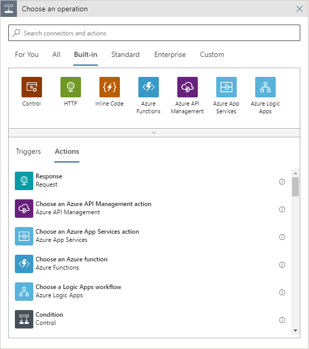

## Azure Service Bus
`Service Bus` is message broker used to decouple applications and services.
See https://docs.microsoft.com/en-us/azure/service-bus-messaging/service-bus-messaging-overview.

In `Service Bus` we can have `Topic` and `Queue`. In this project we use `Service Bus` with name **advania-dev**, Note that `Service Bus` name needs to be unique throughout Azure. Since we create `Service Bus` advania-dev, no one can create `Service Bus` with same name. This `Service Bus` is in `Resource Group` **dev-we-integration-test**, but that is because we had prepared it to be used by many solutions. In solutions it is likely that you will use same `Service Bus` in more than one process. Common `Service Bus` can by center in connecting different process together.

## Azure API Management
`API Management` is used to define API layer against users in secure and scalable way.
See https://docs.microsoft.com/en-us/azure/api-management/.

In `API Management` we can define API's against both internal and external systems / applications. For example, we can take `Logic App`and expose it as API against programs everywhere.
In this project we use `API Management` with name **advania-dev**, Note that `API Management` name needs to be unique throughout Azure. Since we create `API Management` advania-dev, no one can create `API Management` with same name.
This `API Management` is in `Resource Group` **dev-we-api-management-rg**, that is because we want to put all API on same `API Management` instance. We can connect to this `API Management` with following url's:

`Developer Portal` url: https://advania-dev.developer.azure-api.net.

`API Gateway` url: https://advania-dev.azure-api.net.

`API Gateway` url is used to call services exposed by this `API Management` instance.

Most API's we define in `API Management` er locked with API key. In `API Management` we can define access keys for consumers. These API keys are used to exectue services through the `API Gateway` á `API Management` instance.

# Connection Logic App to enda systems (Salesforce and Signet).
To implement the project we create two `Logic App` that starts on triggers. One `Logic App` that monitors that commute contract is created in `Salesforce`,and puts it to signing in `Signet`. Another `Logic App` that monitors that the contract is signed in `Signet`,and returns a signed PDF document to `Salesforce`. 

Before we look at the implantation of these two `Logic Apps` we need to figure out what options we have in connection to these systems in `Logic App`.

## Connection Logic App to Salesforce
Like for many cloud solutions we have ready `Logic App` connector to connect to `Salesforce`. Information can be found on https://docs.microsoft.com/en-us/azure/connectors/connectors-create-api-salesforce. It is very simple to connect to it, you need access information at the `Salesforce` system 
you want to connect to. After the connection has been created in Azure environment, you can use it in `Logic App` against that `Salesforce` instance. 

In our experince in integrating and implementing `Salesforce` solutions, we know that behind the connector there is a well defined REST interface.

### Access to Salesforce
To connect to `Salesforce` you need three things:
* Is it test or production system in `Salesforce`.
* Username.
* Password.

### Create Salesforce connection
To create `Salesforce` connection in `Logic App` you choose to put in `Salesforce` step. In the step you can used already created `Salesforce` connection or create new one as you can see on the following screenshot. 

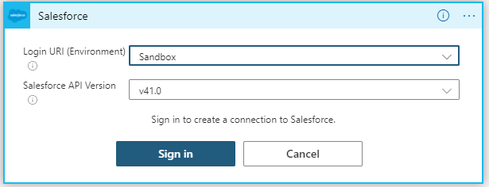

### Salesforce Logic App triggers
All `Logic App` are started by trigger action. `Salesforce` connector offers two types of triggers.

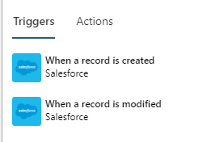

### Salesforce Logic App actions
`Logic App` can then call on action in connectors. `Salesforce` connector offers set of actions.

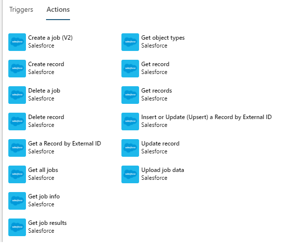

## Connect Logic App to Signet
Unlike `Salesforce`, we do not have connector to `Signet` in Azure environment. We can call `Signet` with SOAP or REST Service. In the implementation we use REST services. Documentation of `Signet` services can be found here https://info.signet.is/
`OpenAPI` documentation on the services is here https://prufa.signet.is/SignetService2/v3/swagger/index.html?url=/SignetService2/v3/swagger/v1/swagger.json

### Access to Signet
To connect to `Signet` you need to know three things:
* Are we connecting to test or production `Signet` (prufa.signet.is eða www.signet.is).
* Username.
* Password.

In addition we must have:
* Client Certificate

The client certificate needs to be used when we call `Signet` to authenticate the client.

### Create Signet connection
Since we do not have connector to `Signet` present in Azure, we have number of options to access the system from `Logic App`. We shall examine the options.

#### Option 1: Create custom connector directly on Signet REST services (Not used in implementation)
Since we have `OpenAPI` definition on services, we could create custom  connector to `Signet` based on referenced documentation earlier mentioned.
When we tried that, there was a problem using client certificate as authentication that way.
That can be confirmed by reading https://docs.microsoft.com/en-us/azure/logic-apps/logic-apps-securing-a-logic-app in chapter "Client Certificate authentication", where it says: "Note: Custom connectors don't support certificate-based authentication for both inbound and outbound calls."

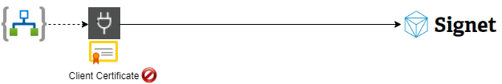

The picture shows that the client certificate prevented this option.

#### Option 2: Call directly on services with HTTP call. (Not used in implementation)
Since we only need to call three services in `Signet` for this project, or 
* AddDocument
* GetDocuments
* DownloadDocument

we looked at the option to call these services directly from `Logic App` with HTTP kalli.
The HTTP action gives us ability to send client certificate. During testing we found out that our Client Certificate had untrusted test root certificate "Advania Prófun", so this option could not be used.

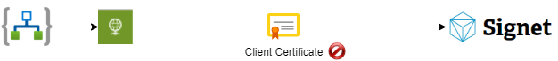

The picture shows that the client certificate was not trusted prevents this option.

#### Option 3: Call the services through API Management. (Used in implementation)
Register `Signet` services to `API Management`,and let `Logic App` call them through `API Gateway`. `API Management` will have the client certificate install and trusted, even though it's root certificate is not trusted.

The way from `Logic App` to `Signet` services is through HTTP call to `API Gateway` https://advania-dev.azure-api.net/signet, that directs the call to https://prufa.signet.is/SignetService2/v3/api/Signet/andbætir and adds the client certificate.
Note that `Logic App` needs API key from`API Management` instance too obtain access to the services.


#### Option 4: Create custom connector through API Management to Signet services (Should be used in the implementation)
Like we see in option 1 above, it is good practice to use `OpenAPI` specification to create custom connector in Azure. The problem in option 1 was that the client certificate was not supported directly.
Since we can register the client certificate in `API Management`, it is option to put `OpenAPI` specification in `API Management`.
We would then create custom connectior in `API Management` instance and create operational connector against `Signet`.
That connector would need to get API key to authenticate against services.

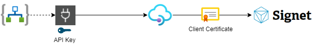

API key will be part of connection info to the `Signet` custom connector.

# Implementation with Logic App
We created 2 `Logic App` to implement this project.

## Logic App logic-we-trigger-sf-to-signet-signing
This `Logic App` is triggered by new commute contract in `Salesforce`. 

To create PDF document with all information according to the new commute contract, we need to look up information of the employee and chief of staff that are connected to the contract. `Salesforce` connector is used in these lookups.

PDF document is created by calling `Logic App` (**logic-pub-create-pdf**). Input is information about the commute contract received form `Salesforce`.

Finally PDF document is sent to `Signet` for signing. Since we did not use option 4 to create `Signet` connection as described above, we wrapped call to `AddDocument` in `Logic App` (**logic-we-signet-adddocument**). See information about option 3 in section about um `Signet` connection above.

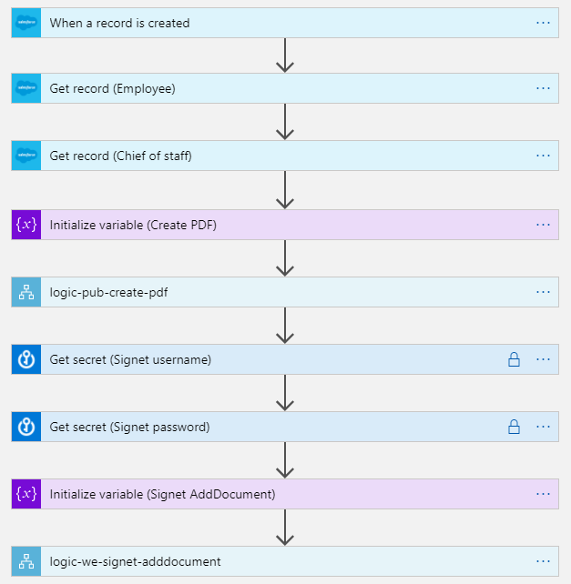

This process is 3 main steps, that we can look at.

### Data from Salesforce
The first 3 actions are retrieving information about the commute contract from `Salesforce`. 

Trigger in this `Logic App` is that there is new record created in `Salesforce` of type commute contract (is:Samgöngusamningur). As seen in the picture this is checked every 3 minutes, which means that it can be up to 3 minutes from the creation of the contract until `Logic App` starts. 

Next step looks up information about both the employee and chief of staff in two steps. The input to the lookup is retrieved from the data received with the commute contract.
In the commute contract we have field for employee and chief of staff containing reference to theyr `Salesforce` records.

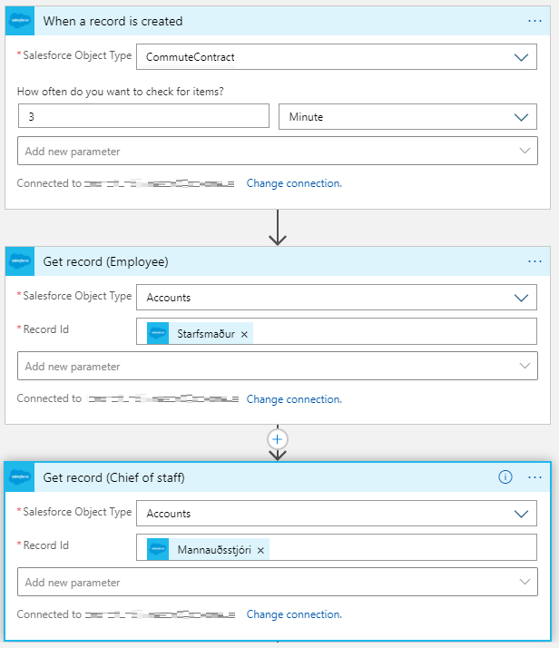

### Create PDF
The commute contract in `Salesforce` does not contain PDF document for signing. In this step we utilize service to create PDF. 
The PDF service is á REST service that creates nice PDF with all information in the commute contract.

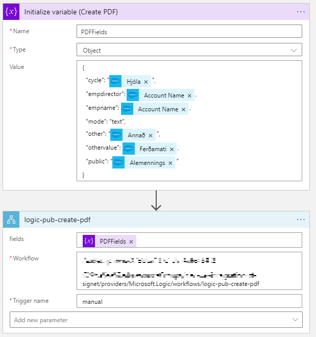

In this step we create JSON object `PDFFields`, in the fields of the document we put data from all the `Salesforce` steps previously executed.
Es example the element empname in `PDFFields` is set as Account Name from `Salesforce` step GetRecord (Starfsmaður), see image.

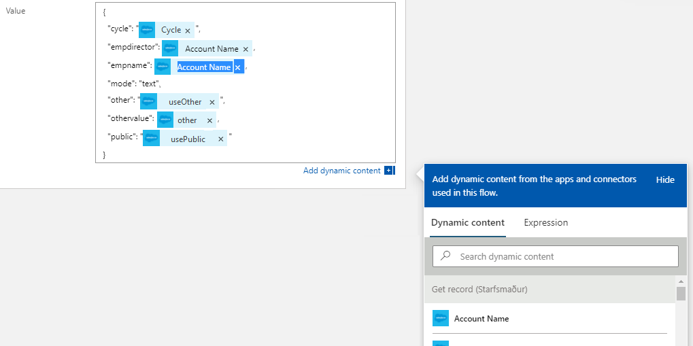

These `PDFFields` are input in **logic-pub-create-pdf** which wraps REST service to create PDF document. 

These example shows how variables are accessable to steps in `Logic App`.

NOTE Sensitive information is blurred in images.

### Send to Signet
Now we have ready PDF document, and the only thing left is to send it to `Signet` for signing. 
The `Signet` services requiers you to send username and password as part of input data. It means that we need to have that available when we call `Signet`. Since we do not want to have passwords in clear text we use`Key Vault` too keep username and password to `Signet`. 
Information about um `Azure Key Vault` can be found here https://docs.microsoft.com/en-us/azure/key-vault/.

Sending document to `Signet` contains steps to get the access information in `Key Vault`. Create JSON object with command to create document in `Signet` and finally upload the document.
Note the lock on the steps to retrieve access information. We put it on the steps to tell that the output contains sensitive information that cannot be displayed.
See further information on https://docs.microsoft.com/en-us/azure/logic-apps/logic-apps-securing-a-logic-appandsér in section "Secure data in run history by using obfuscation". 
These setting can be put on any steps. Then we can make sure that any service that retrieves sensitive information will not log or display that data.

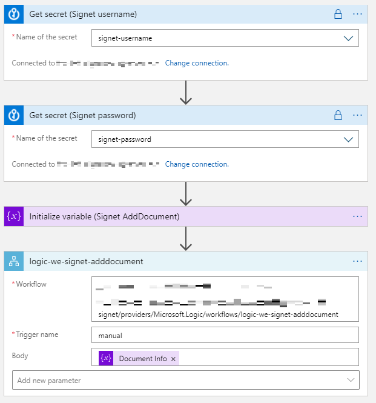

In the same way as we created PDF document, we create JSON object `Document Info` according to documentation from `Signet` with all information required to send document to signing.

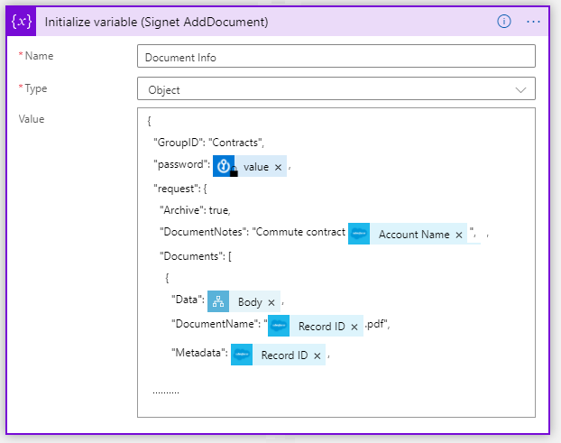

As we can see on `AddDocument` call, we are reffering date from all previously executed steps.
We see that password has black lock on it, meaning that it comes from step marked as sensitive information.

Note that we put reference to the `Salesforce` commute contract in field named `Metadata` in `Signet`. This is used to correlate the document in `Signet` with the commute contract in `Salesforce`. 
Later when we get the signed PDF from `Signet`, we know what commute contract we need to attach the document to, base on this `Metadata`. 

## Logic App logic-we-scheduler-signet-signed-to-sf
When we want to receive the signed commute contract from `Signet` we have few options. The best option is by `Webhook` or callback url where `Signet` will notify when document is signed.
Á callback url can be defined in `Signet`. However, we decided to use `Service Bus` and scheduler to implement this as a starting point.

We let this `Logic App` work with `Queue` in `Service Bus`. In this `Queue` we keep the timestamp on last signed document.

This type of processing is similar to the one done by other integration tools. Many application do not support `Webhook`, so we need other means to keep track on what has been synced.
Each run of the `Logic App`  is getting changes from given time to now.
When the `Logic App` has completed we have stored the next timestamp to work from in `Queue`. Usually we do not use `Queue` to store information but we wanted to examine `Service Bus` connection in `Logic App`.

This `Logic App` starts every 3 minutes. 

When executed it checks if there are new signed documents in `Signet` from timestamp stored in `Queue`.
If we find new signed documents, they are attached to the commute contract in `Salesforce` and new timestamp is stored on the `Queue`.
That is to make sure that next run will only get new documents.

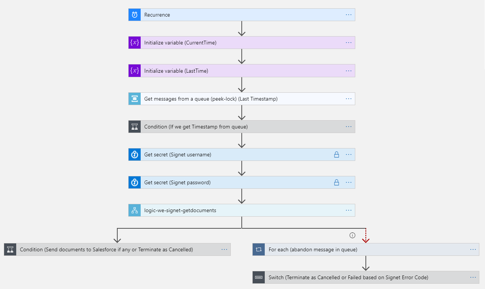

This `Logic App` contains statements that we did not need to use in **logic-we-trigger-sf-to-signet-signing**.

This process is actually 4 main operations.

### Get and put timestamp from Queue.
The process retrieves timestamp to work from in `Queue` in `Service Bus` with action. Then we get the timestamp that last execution put on the `Queue`.
The message is locked so other processes will not get the same message from the `Queue` for 30 seconds.
We need to either complete the message or abandon the message before the lock expires.

Actions in `Service Bus` that we use are.

* Get message (Get messages from a queue (peek-lock))
* Complete message (Complete the message in a queue)
* Abandon message (Abandon the message in a queue)
* Send message (Send message)

If we get new documents to sign, we complete the message and put new timestamp on the `Queue`. If no new documents are retrieved, we abandon the message, and will get same timestamp in next run.

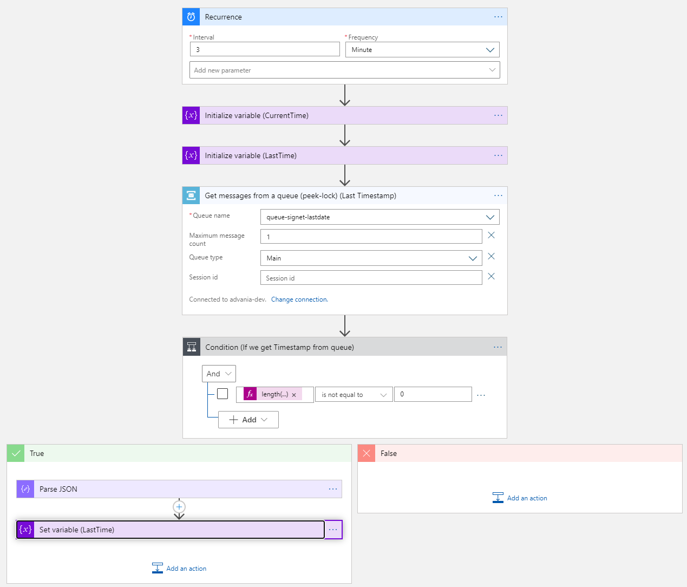

As seen in the image we use current timestamp if the `Queue` does not contain timestamp.

To check if we retrieved timestamp from the `Queue` we check length if the length of message list is other than 0.
We put the maximum message count to retrieve as 1 to make sure we only get one timestamp from the `Queue`.

### Get list of signed documents from Signet.
We get list of signed documents by retrieve all documents with status 3 (meaning signed) from `Signet`. We search for documents from `lastTime` (the timestamp from the `Queue`) to `CurrentTime`.
Like in **logic-we-trigger-sf-to-signet-signing** we retrieve access information to `Signet` from `Key Vault`. We wrap the call to `GetDocuments` in another `Logic App` (**logic-we-signet-getdocuments**).

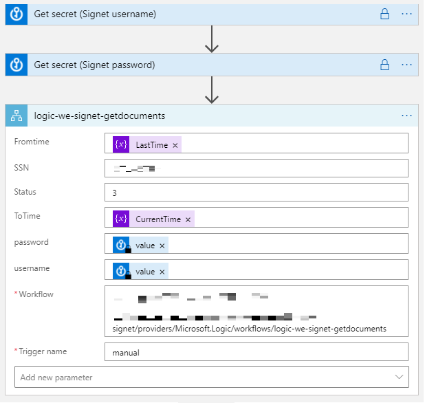

### Send signed documents to Salesforce.
If we get list of documents from `Signet` that is not empty, we start few loops to send PDF documents to `Salesforce`.
It is because `GetDocuments` returns list of document id's from `Signet` without content. 
We then retrieve the payload of each document from `Signet` by sending the document id to `DownloadDocument`.
`DownloadDocument` returns list of PDF documents for that id.
We need to loop over 2 lists in order to send the documents to `Salesforce`.

Pseudo code of sending documents to `Salesforce` that we implement in this `Logic App` is:

```
for each document id from GetDocuments (Signet)
	call DownloadDocument (Signet) with document id
	for each payload from DownloadDocument (Signet)
		call UploadDocument (Salesforce)
```
Like in previous interface to`Signet` we put the action to `DownloadDocument` in `Logic App` (**logic-we-signet-downloaddocument**).

We wrap the action to upload the document to `Salesforce` in `Logic App` (**pub-we-sf-uploaddocument**). 
The operation to upload the document to `Salesforce` is more than one step. First we need to upload the document to `Salesforce` and then we need to connect it to correct commute contract.
That is the reason we put it in specific `Logic App`. As seen in screenshot we define what input values are expected in **pub-we-sf-uploaddocument**.
Note the `Metadata` field. It is the field we use to connect to the `Salesforce` commute contract when we send the PDF document to `Signet`.

When all the signed PDF documents have been uploaded to `Salesforce`, we put `CurrentTime` as new timestamp on the `Queue`.

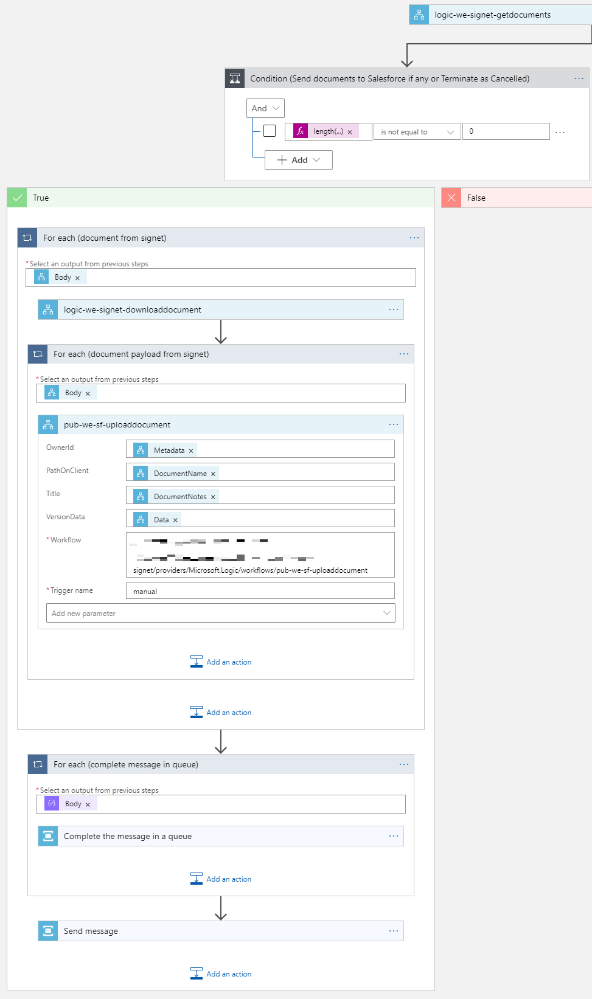

### Set execution run as 'Cancelled' if no signed documents are retrieved from Signet.
Since the `Logic App` runs every 3 minutes, we can hit cases that no document has been signed since last run.
We still see the execution as successful in run history.

All `Logic App` have execution history where we can see information about each run. Both what steps are executed and what data is retrieved.
If we look at the run history we see that all executions are successful every three minutes, also those that did not retrieve signed documents from `Signet` to send `Salesforce`.

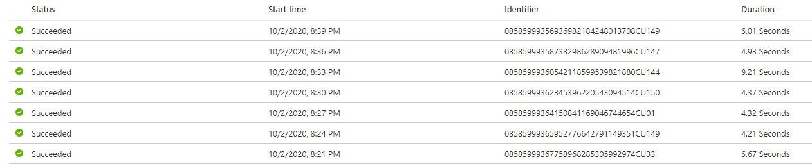

We want to separate the runs that actually do something to the ones that do nothing.
Í **logic-we-scheduler-signet-signed-to-sf** this is not a problem, since the `Logic App` does not start except it is something to process from `Salesforce`.
The way we used is to use the `Terminate` action in `Logic App`. Then we can let the process stop with different status.
Available status are 'Succeeded','Failed'and'Cancelled'. We choose to let the instance terminate with status 'Cancelled' When no documents are retrieved. 

After adding this to the `Logic App` the execution history changes. Only instances that find signed documents in `Signet` have the status 'Succeeded'. 
other instances have the status 'Cancelled'. Of course we can get errors and then the instance gets status 'Failed'. 
Below execution history shows example of all the statuses.

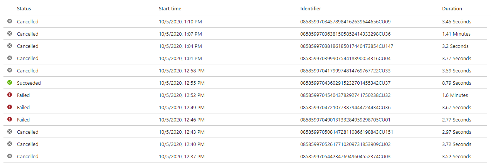

If we look at the implementation, there are two cases of response from the `GetDocuments` call to`Signet` that tells us that no signed documents were retrieved for period:
* `200 OK`and empty list of data. 
* `400 Bad Request`and error JSON that contains "StatusCode": "10" with error text "No documents found".

The difference on the responses is that when `Signet` returns `200 OK` there are documents in the period, bu none is signed. 
If `400 Bad Request` is returned, there are no documents in the period.

When service does not respond with code between 200 and 299, we have a exception. 
To handle exceptions we need to create path that from step that only runs on exception (exception handling).

In `Logic App` the steps to terminate the execution with status 'Cancelled' is on two places to cover both cases.

#### 200 OK and empty list of documents.

Here we get `200 OK`, but no documents from `Signet`. Then we abandon the timestamp message and terminate with status 'Cancelled'.
Same timestamp will be used in next execution. 

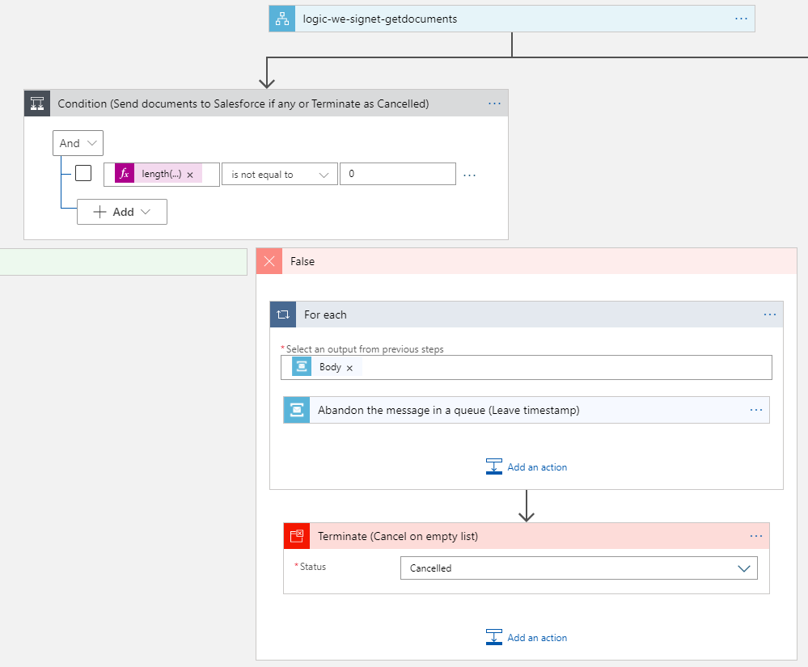

#### 400 Bad request and "Status Code" is 10.

In this case the `GetDocuments` call return exception. We handle it by creating a path in `Logic App` that runs on the exception.
Note the red dots and information sign on the path. It tells us that it is settings on the path are used to determine when it is taken.

On the exception path we abandon the timestamp message and terminate with status 'Cancelled'.

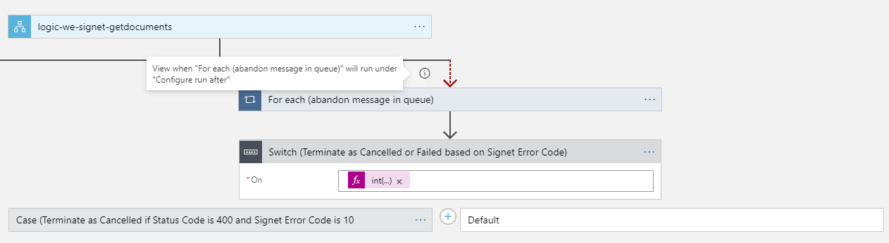

We only want to terminate instance as 'Cancelled' if "Status Code" from `Signet` is 10. We have `Case` statement for the 400 response that checks if  "Status Code" is 10 and terminates with status 'Cancelled'.

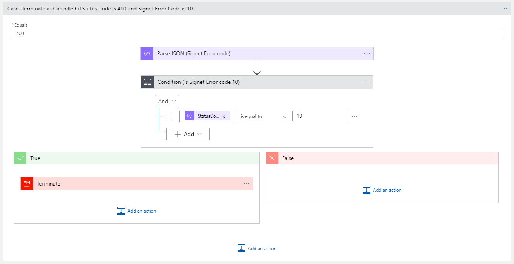


> published 23.11.2020, Þorleifur Bjarnason.

